# Labs Overview

This page provides an overview of all 12 lab exercises in the standard learning track. Each lab builds on previous knowledge and includes hands-on, step-by-step instructions.

## Lab Progression Map

```mermaid
graph LR
    A["Lab 00<br/>Environment Setup"] --> B["Lab 01<br/>Docker Basics"]
    B --> C["Lab 02<br/>K8s Pods"]
    C --> D["Lab 03<br/>Deployments"]
    D --> E["Lab 04<br/>Services"]
    E --> F["Lab 05<br/>ConfigMaps/Secrets"]
    F --> G["Lab 06<br/>Helm Charts"]
    G --> H["Lab 07<br/>Multi-Region"]
    H --> I["Lab 08<br/>Sidecars"]
    I --> J["Lab 09<br/>Flux GitOps"]
    J --> K["Lab 10<br/>Observability"]
    K --> L["Lab 11<br/>Troubleshooting"]
```




## Lab Summary Table

| Lab | Name | Duration | Key Topics | Prerequisites |
|-----|------|----------|-----------|---|
| **00** | Environment Setup | 30 min | Minikube, kubectl, Helm, Flux, Docker | Docker Desktop installed |
| **01** | Docker Basics | 1-2 hrs | Dockerfile, image building, pushing to registry | Lab 00 complete |
| **02** | Kubernetes Pods | 1 hr | Pod manifests, labels, resource requests | Lab 01 complete |
| **03** | Deployments & Replicas | 1.5 hrs | Deployments, scaling, rolling updates | Lab 02 complete |
| **04** | Services & Discovery | 1 hr | ClusterIP, NodePort, LoadBalancer, DNS | Lab 03 complete |
| **05** | ConfigMaps & Secrets | 1 hr | Environment configuration, sensitive data | Lab 04 complete |
| **06** | Helm Charts | 2 hrs | Chart structure, templating, dependencies | Lab 05 complete |
| **07** | Multi-Region Setup | 1.5 hrs | kind/Minikube clusters, networking, contexts | Lab 06 complete |
| **08** | Sidecars & Networking | 2 hrs | Sidecar pattern, logging proxy, metrics proxy | Lab 07 complete |
| **09** | Flux GitOps | 1.5 hrs | Flux installation, HelmRelease, Git sync | Lab 08 complete |
| **10** | Observability | 2 hrs | Prometheus, Grafana, Loki, alerting | Lab 09 complete |
| **11** | Troubleshooting | 2 hrs | Debugging pods, networking, logs, events | Lab 10 complete |

## Detailed Lab Descriptions

### **Phase 1: Containerization**

#### **Lab 00: Environment Setup** (30 min)
**What you'll do:**

- Verify Docker, Kubernetes, Helm, Flux installation
- Set up Minikube cluster (or Minikube + kind for multi-region)
- Configure kubectl context
- Test local Kubernetes access

**Expected outcome:** 
```bash
$ kubectl cluster-info
Kubernetes control plane is running at https://127.0.0.1:62xxx
CoreDNS is running at https://127.0.0.1:62xxx

```

---

#### **Lab 01: Docker Basics** (1-2 hrs)
**What you'll do:**

- Examine sample Dockerfile
- Build a Docker image locally
- Test image with `docker run`
- Push image to Docker Hub or ghcr.io
- Pull and verify image on another system

**Expected outcome:**
```
$ docker images
yourusername/myapp    1.0.0  abc123...  100MB
$ docker push yourusername/myapp:1.0.0
Pushed successfully to registry

```

---

### **Phase 2: Kubernetes Fundamentals**

#### **Lab 02: Kubernetes Pods** (1 hr)
**What you'll do:**

- Create pod manifests with labels
- Deploy pods to K8s cluster
- Inspect pod details and logs
- Apply resource requests/limits
- Understand pod lifecycle

**Expected outcome:**
```
$ kubectl get pods -l app=api
NAME                READY   STATUS
api-pod-1           1/1     Running
api-pod-2           1/1     Running

```

---

#### **Lab 03: Deployments & Replicas** (1.5 hrs)
**What you'll do:**

- Create Deployment manifests
- Scale replicas up and down
- Watch rolling updates in action
- Configure health checks (liveness/readiness)
- Understanding init containers

**Expected outcome:**
```
$ kubectl scale deployment/api --replicas=5
Scaled to 5 pods
$ kubectl rollout status deployment/api
Waiting for rollout to finish: 3 of 5 replicas ready

```

---

#### **Lab 04: Services & Discovery** (1 hr)
**What you'll do:**

- Create ClusterIP service (internal)
- Create NodePort service (external)
- Test service discovery with DNS
- Port-forward for local testing
- Understanding Endpoints

**Expected outcome:**
```
$ kubectl get svc api-service
NAME          TYPE      CLUSTER-IP     EXTERNAL-IP   PORT(S)
api-service   NodePort  10.96.100.50   <none>        8080:31234/TCP

```

---

#### **Lab 05: ConfigMaps & Secrets** (1 hr)
**What you'll do:**

- Create ConfigMaps from files
- Create Secrets for sensitive data
- Mount ConfigMaps as environment variables
- Mount Secrets as volumes
- Update configurations without redeploying

**Expected outcome:**
```
$ kubectl get configmaps
api-config  ConfigMap
$ kubectl get secrets
api-secrets Secret

```

---

### **Phase 3: Helm & Packaging**

#### **Lab 06: Helm Charts** (2 hrs)
**What you'll do:**

- Understand Helm chart structure
- Create a Helm chart from scratch
- Template values and dependencies
- Deploy with Helm
- Upgrade and rollback releases

**Expected outcome:**
```
$ helm list
NAME       NAMESPACE   STATUS    CHART
api-app    default     deployed  microservices-1.0.0
$ helm upgrade api-app ./charts/microservices
Upgraded release microservices in 2 seconds

```

---

### **Phase 4: Multi-Region & Sidecars**

#### **Lab 07: Multi-Region Setup** (1.5 hrs)
**What you'll do:**

- Create 2 Kubernetes clusters (east and west regions)
- Configure kubectl contexts
- Deploy same app to both clusters
- Set up inter-cluster networking
- Test multi-region failover

**Expected outcome:**
```
$ kubectl get nodes --context=east
$ kubectl get nodes --context=west
# Both clusters running independently

```

---

#### **Lab 08: Sidecars & Networking** (2 hrs)
**What you'll do:**

- Understand sidecar pattern
- Deploy logging sidecar (collects and forwards logs)
- Deploy metrics sidecar (proxies metrics requests)
- Configure inter-pod communication
- Test cross-cluster communication

**Expected outcome:**
```
Requests:
  east-api → sidecar → west-api (via cross-cluster networking)
  Logs collected and forwarded to central sidecar

```

---

### **Phase 5: GitOps & Observability**

#### **Lab 09: Flux GitOps** (1.5 hrs)
**What you'll do:**

- Install Flux CD on clusters
- Create HelmRelease manifests
- Push configs to Git repository
- Watch Flux auto-apply changes
- Understand GitOps drift detection

**Expected outcome:**
```
$ flux get helmreleases
NAME     NAMESPACE  REVISION  SUSPENDED  STATUS
api-app  default    1.2.3     False      Reconciling
# Git push automatically triggers deployment

```

---

#### **Lab 10: Observability** (2 hrs)
**What you'll do:**

- Deploy Prometheus (scrapes metrics)
- Deploy Grafana (visualizes dashboards)
- Deploy Loki (log aggregation)
- Query metrics with PromQL
- Create custom dashboards
- Set up alerts

**Expected outcome:**
```
Grafana Dashboard:
  - CPU/Memory usage by pod
  - Request latency by service
  - Error rates
  - Application custom metrics

```

---

#### **Lab 11: Troubleshooting** (2 hrs)
**What you'll do:**

- Debug pod failures (CrashLoopBackOff, etc.)
- Inspect events and logs
- Network debugging (DNS, connectivity)
- Performance troubleshooting
- Using kubectl describe, logs, exec

**Expected outcome:**
Resolve several broken scenarios:

- Pod stuck in Pending
- Service not reaching pods
- Memory leaks in container
- Network policy blocking traffic

---

## How to Navigate Labs

### **For Each Lab:**

1. **Read the objectives** — Understand what you're learning
2. **Review prerequisites** — Ensure prior labs are complete
3. **Follow step-by-step instructions** — Commands are copy-paste ready
4. **Validate your work** — Verification commands provided
5. **Try the challenge** — Deepdive optional explorations
6. **Clean up** — Provided teardown commands

### **Lab Format**

Each lab includes:

```
## Lab N: [Title]

### Objectives
- Goal 1
- Goal 2
- Goal 3

### Prerequisites
- Lab N-1 complete
- Tool X installed

### Step 1: [Description]
[Instructions with commands]

### Step 2: [Description]
[Instructions with commands]

### Validation
How to verify success

### Challenge (Optional)
Deepdive exploration

### Cleanup
Remove resources created in this lab
```

---

## Estimated Timeline

| Phase | Labs | Duration | Cumulative |
|-------|------|----------|-----------|
| Phase 1: Containerization | 00-01 | 2 hrs | 2 hrs |
| Phase 2: K8s Fundamentals | 02-05 | 4.5 hrs | 6.5 hrs |
| Phase 3: Helm | 06 | 2 hrs | 8.5 hrs |
| Phase 4: Multi-Region | 07-08 | 3.5 hrs | 12 hrs |
| Phase 5: GitOps & Observability | 09-10 | 3.5 hrs | 15.5 hrs |
| Phase 6: Troubleshooting | 11 | 2 hrs | 17.5 hrs |

**Total: ~17.5 hours** (standard track with breaks)

---

## Tips for Success

✅ **Do one lab at a time** — Don't skip prerequisites  
✅ **Type the commands** — Don't just copy-paste (builds muscle memory)  
✅ **Try the challenges** — Deepens understanding  
✅ **Break between phases** — Process what you've learned  
✅ **Reference theory modules** — Use them while doing labs  
✅ **Cleanup properly** — Keeps your clusters lean  

---

## Troubleshooting Labs

If you get stuck:

1. **Re-read the lab instructions** — Often the answer is there
2. **Check the theory module** — Understand the "why"
3. **Inspect resources**: 
   ```bash
   kubectl describe pod <name>
   kubectl logs <pod-name>
   kubectl get events
   ```

4. **Check cluster health**:
   ```bash
   kubectl get nodes
   kubectl cluster-info
   ```

5. **Revert and restart** — Use cleanup commands and start over

---

## Next Steps

Ready to get started?

1. **[Lab 00: Environment Setup](labs/00-environment-setup.md)** ← Start here
2. **[Theory 01: DevOps Fundamentals](theory/01-devops-fundamentals.md)** ← Read first
3. **[Lab 01: Docker Basics](labs/01-docker-basics.md)** ← Then do this
