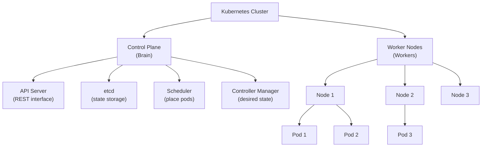
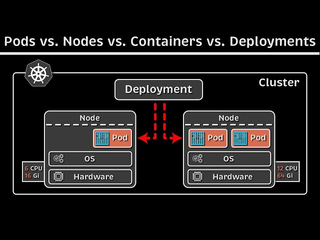
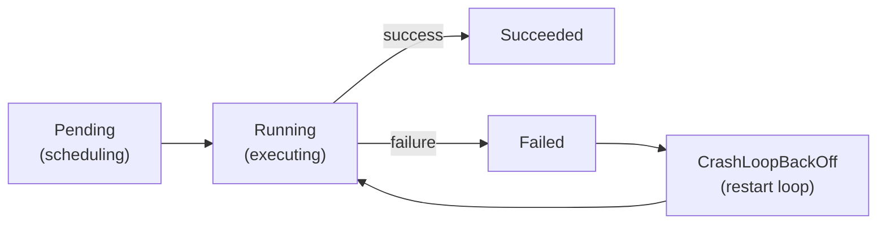

# 03: Kubernetes Fundamentals

## Definition

**Kubernetes (K8s)** = Orchestration platform for:

- Deploying containers at scale
- Managing networking between containers
- Persisting data
- Auto-scaling and self-healing
- Rolling updates with zero downtime

### **Why Kubernetes?**


```
Without Kubernetes:
  - 100 containers across 50 servers
  - Which server? Crashed? Need to restart? 
  - Networking? Load balancing? Configuration?
  → Manual managing nightmare, human error prone

With Kubernetes:
  - "Deploy 100 replicas of my app"
  - K8s figures out which nodes, restart failures, load balancing
  → Automated, reliable, scales automatically
```

---

## Kubernetes Architecture




### **Key Components**


)

#### **Control Plane**

| Component | Role |
|-----------|------|
| **API Server** | REST interface for K8s; every action goes through here |
| **etcd** | Distributed key-value store; stores all cluster state |
| **Scheduler** | Decides which node each pod should run on |
| **Controller Manager** | Runs "controllers" that enforce desired state |

#### **Worker Nodes**

| Component | Role |
|-----------|------|
| **kubelet** | Agent on each node; ensures pods are running |
| **kube-proxy** | Networking; handles service to pod routing |
| **Container Runtime** | Docker, containerd, CRI-O; runs containers |

---

## Core K8s Concepts

### **1. Pod (Smallest Unit)**

A **Pod** = 1+ containers (usually 1) that share:

- Network namespace (share IP, can communicate via localhost)
- Storage volumes
- Configuration

??? note "YAML example"

    ```yaml
    apiVersion: v1
    kind: Pod
    metadata:
      name: my-pod
    spec:
      containers:
      - name: api
        image: myapp:1.0.0
        ports:
        - containerPort: 5000
    ```

**Key insight:** Pods are ephemeral. Don't create pods directly; use Deployments instead.

### **2. Deployment (Manage Replicas)**

A **Deployment** = Describes desired state of pods.

??? note "YAML example"

    ```yaml
    apiVersion: apps/v1
    kind: Deployment
    metadata:
      name: api-deployment
    spec:
      replicas: 3  # Run 3 copies
      selector:
        matchLabels:
          app: api
      template:
        metadata:
          labels:
            app: api
        spec:
          containers:
          - name: api
            image: myapp:1.0.0
            ports:
            - containerPort: 5000
    ```

Kubernetes automatically:

- Creates 3 pods
- Restarts if any crashes
- Updates all pods if image version changes
- Scales up/down as needed

### **3. Service (Networking)**

Pods are ephemeral (can be destroyed). **Service** = stable endpoint for accessing pods.

??? note "YAML example"

    ```yaml
    apiVersion: v1
    kind: Service
    metadata:
      name: api-service
    spec:
      selector:
        app: api  # Route to pods with this label
      ports:
      - port: 80
        targetPort: 5000
      type: ClusterIP  # Internal only (or NodePort, LoadBalancer)
    ```

Types:

- **ClusterIP**: Internal communication only
- **NodePort**: Expose on each node's port
- **LoadBalancer**: Cloud load balancer

### **4. Namespace (Logical Isolation)**

Namespaces = logical clusters within one K8s cluster.

```bash
# Create namespace
kubectl create namespace production

# Deploy to specific namespace
kubectl apply -f deployment.yaml -n production

# List resources in namespace
kubectl get pods -n production

```

Common namespaces:

- `default` — Default namespace for testing
- `kube-system` — Kubernetes system components
- `production` — Production apps
- `staging` — Staging apps

### **5. Labels & Selectors (Organization)**

Labels = key-value metadata. Selectors = queries on labels.

```
apiVersion: apps/v1
kind: Deployment
metadata:
  name: api
  labels:
    app: api
    version: v1
spec:
  selector:
    matchLabels:
      app: api  # Match pods with this label
  template:
    metadata:
      labels:
        app: api
        version: v1
```

Query by labels:
```bash
kubectl get pods -l app=api
kubectl get pods -l app=api,version=v1
```

---

## Pod Lifecycle



**Pending**: Waiting to be scheduled or pulling image  
**Running**: Container is running  
**Succeeded**: Pod completed successfully  
**Failed**: Container exited with error  
**CrashLoopBackOff**: Container crashes repeatedly; K8s keeps restarting it

---

## Key K8s Resources

| Resource | Purpose |
|----------|---------|
| **Pod** | Single or multiple containers |
| **Deployment** | Stateless workload (manage replicas) |
| **StatefulSet** | Stateful workload (databases, etc.) |
| **DaemonSet** | Run on every node (logging agent, etc.) |
| **Job** | One-time task (batch processing) |
| **CronJob** | Scheduled task (backups, etc.) |
| **Service** | Network endpoint for pods |
| **Ingress** | HTTP load balancer / reverse proxy |
| **ConfigMap** | Configuration data (non-sensitive) |
| **Secret** | Sensitive data (passwords, tokens) |
| **PersistentVolume** | Storage resource |
| **PersistentVolumeClaim** | Request for storage |

---

## Health Management

### **Liveness Probe**

Checks if container should be restarted.

```
apiVersion: v1
kind: Pod
metadata:
  name: api
spec:
  containers:
  - name: api
    image: myapp:1.0.0
    livenessProbe:
      httpGet:
        path: /alive
        port: 5000
      initialDelaySeconds: 10
      periodSeconds: 5
      failureThreshold: 3
```

If `/alive` fails 3 times → container gets restarted.

### **Readiness Probe**

Checks if pod should receive traffic.

```yaml
readinessProbe:
  httpGet:
    path: /ready
    port: 5000
  initialDelaySeconds: 5
  periodSeconds: 10
```

If not ready → Service stops routing traffic to this pod.

### **Resource Requests & Limits**

??? note "YAML example"

    ```yaml
    spec:
      containers:
      - name: api
        image: myapp:1.0.0
        resources:
          requests:
            memory: "256Mi"   # Need at least 256MB
            cpu: "100m"       # Need at least 0.1 cores
          limits:
            memory: "512Mi"   # Max 512MB
            cpu: "500m"       # Max 0.5 cores
    ```

**Requests**: K8s uses to schedule pod (must fit on node)  
**Limits**: Container can't exceed this

---

## Common kubectl Commands

```bash
# Get resources
kubectl get pods
kubectl get pods -n production
kubectl get pods -o wide  # More details
kubectl get deployments
kubectl get services

# Describe resource
kubectl describe pod my-pod

# View logs
kubectl logs my-pod
kubectl logs my-pod -f  # Follow logs
kubectl logs my-pod -c container-name  # Specific container

# Execute command in pod
kubectl exec -it my-pod -- /bin/bash

# Port-forward (access pod locally)
kubectl port-forward my-pod 8080:5000

# Apply manifest
kubectl apply -f deployment.yaml

# Delete resource
kubectl delete pod my-pod
kubectl delete deployment my-app

# Rollout management
kubectl rollout status deployment/my-app
kubectl rollout history deployment/my-app
kubectl rollout undo deployment/my-app  # Rollback

# Scale deployment
kubectl scale deployment/my-app --replicas=5

# Get events
kubectl get events
```

---

## Interview Questions

**Q: What's the difference between a Pod and a Deployment?**

A: Pod is a single container instance (ephemeral). Deployment manages multiple pods, handles restarts, updates, and scaling. Create Deployments, not Pods directly.

**Q: What does NodePort do?**

A: Exposes a service on every node's IP at a specific port. Useful for external access without a cloud load balancer.

**Q: What's the difference between Liveness and Readiness probes?**

A: **Liveness** = restart if unhealthy. **Readiness** = remove from load balancer if not ready (but don't restart).

---

## Key Takeaways

✅ **K8s automates deployment, scaling, and management of containers**  
✅ **Pods are ephemeral; use Deployments for stateless apps**  
✅ **Services provide stable network endpoints**  
✅ **Labels enable organization and selection**  
✅ **Health checks (liveness/readiness) keep system healthy**  
✅ **Namespaces provide logical isolation**  
✅ **Resource requests/limits prevent pod overload**  

---

## Next Steps

- **Read**: [Theory 04: Workloads & Deployments](04-workloads-and-deployments.md)
- **Do**: [Lab 02: Kubernetes Pods](../labs/02-kubernetes-pods.md)
