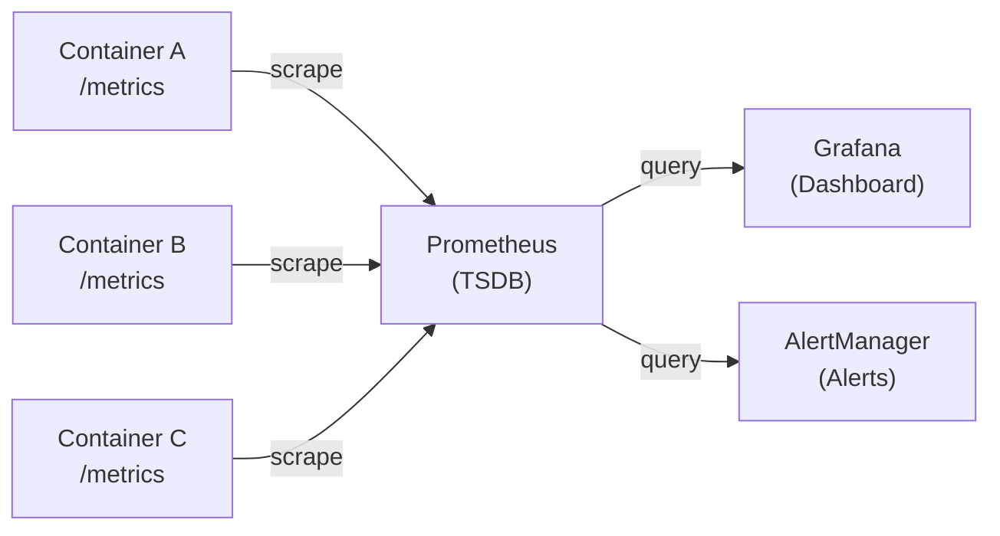

# 08: Observability

## The Three Pillars

### **1. Metrics (What?)**

Numeric measurements over time.

**Examples:**

- CPU usage: 75%
- Memory: 512MB / 1GB
- Request latency: 45ms
- Error rate: 0.5%
- HTTP requests/sec: 1000

**Tool:** Prometheus (time-series database)

### **2. Logs (Why?)**

Discrete events with context.

**Examples:**
```
2024-01-15T10:23:45Z ERROR Database connection failed: timeout
2024-01-15T10:23:46Z INFO Retrying connection (attempt 2/5)
2024-01-15T10:23:47Z INFO Connection established to postgres:5432
```

**Tool:** Loki (log aggregation)

### **3. Traces (How?)**

Request path across microservices.

**Example:**
```
Request to API Server
  ├─ Auth Service (5ms)
  ├─ Database Query (20ms)
  ├─ Cache Lookup (2ms)
  └─ Response (2ms)
Total: 29ms
```

**Tool:** Jaeger (distributed tracing)

---

## Prometheus (Metrics)

### **Architecture**



### **Setup**

**prometheus.yml** (configuration):
??? note "YAML example"

    ```yaml
    global:
      scrape_interval: 15s
      evaluation_interval: 15s
    
    scrape_configs:
    
    - job_name: 'kubernetes-pods'
      kubernetes_sd_configs:
      - role: pod
      relabel_configs:
      - source_labels: [__meta_kubernetes_pod_annotation_prometheus_io_scrape]
        action: keep
        regex: true
      - source_labels: [__meta_kubernetes_pod_annotation_prometheus_io_path]
        target_label: __metrics_path__
        regex: (.+)
      - source_labels: [__address__, __meta_kubernetes_pod_annotation_prometheus_io_port]
        action: replace
        regex: ([^:]+)(?::\d+)?;(\d+)
        replacement: $1:$2
        target_label: __address__
    ```

### **Querying (PromQL)**


```promql
# Current CPU usage
rate(container_cpu_usage_seconds_total[5m])

# Request latency p95
histogram_quantile(0.95, rate(http_request_duration_seconds_bucket[5m]))

# Error rate
rate(http_requests_total{status=~"5.."}[5m])

# Memory usage
container_memory_usage_bytes / (1024 * 1024)  # In MB

# Pod restart count
increase(kube_pod_container_status_restarts_total[1h])
```

---

## Grafana (Dashboards)

Visualize Prometheus metrics.

```
Panel 1: CPU Usage                Panel 2: Memory Usage
  ├─ Pod A: 45%                     ├─ Pod A: 450MB / 1GB
  ├─ Pod B: 52%                     ├─ Pod B: 380MB / 1GB
  └─ Pod C: 38%                     └─ Pod C: 290MB / 1GB

Panel 3: Request Latency           Panel 4: Error Rate
  └─ 50th: 45ms                     └─ 0.5%
     95th: 120ms
     99th: 250ms
```

**Alerting Rule:**

??? note "YAML example"

    ```yaml
    groups:
    
    - name: api_alerts
      rules:
      - alert: HighCPUUsage
        expr: rate(container_cpu_usage_seconds_total[5m]) > 0.8
        for: 5m
        annotations:
          summary: "Pod {{ $labels.pod }} has high CPU > 80%"
      
      - alert: HighErrorRate
        expr: rate(http_requests_total{status=~"5.."}[5m]) > 0.01
        for: 2m
        annotations:
          summary: "Error rate > 1%"
    ```

---

## Loki (Log Aggregation)

Lightweight log aggregation (Prometheus-like for logs).

### **Architecture**

```
Promtail (agent on nodes)
    ├─ Reads logs from files
    ├─ Adds labels
    └─ Sends to Loki
        ├─ Stores compressed logs
        └─ Queryable via Grafana
```

**Configuration** (promtail-config.yaml):

??? note "YAML example"

    ```yaml
    clients:
      - url: http://loki:3100/loki/api/v1/push
    
    scrape_configs:
    
    - job_name: kubernetes
      kubernetes_sd_configs:
      - role: pod
      relabel_configs:
      - source_labels: [__meta_kubernetes_pod_name]
        target_label: pod
      - source_labels: [__meta_kubernetes_namespace_name]
        target_label: namespace
    ```

### **Querying (LogQL)**

```logql
# All logs from api pod
{pod="api"}

# ERROR logs from api
{pod="api"} |= "ERROR"

# Latency distribution
{job="api"} | pattern `<_> <_> <_> <response_time:number>ms` | rate(__error__ [5m])
```

---

## Jaeger (Distributed Tracing) *Optional*

Track request across microservices.

**Example Trace:**

```
Request ID: abc123

API Service (10ms)
├─ Receive request (1ms)
├─ Auth service call (3ms)  ← Separate span
│  └─ Auth service (2ms)
├─ Database call (5ms)      ← Separate span
│  └─ Postgres (5ms)
└─ Response (1ms)
```

**Instrumentation:**


```python
from jaeger_client import Config

config = Config(
    config={
        'sampler': {'type': 'const', 'param': 1},
        'local_agent': {'reporting_host': 'jaeger', 'reporting_port': 6831},
    },
    service_name='api-service',
)
tracer = config.initialize_tracer()

with tracer.start_active_span('process-request') as scope:
    # Span automatically tracked
    db_result = query_database()
```

---

## Stack Deployment (Kubernetes)

??? note "YAML example"

    ```yaml
    # 1. Namespace
    apiVersion: v1
    kind: Namespace
    metadata:
      name: monitoring
    
    ---
    # 2. Prometheus ConfigMap
    apiVersion: v1
    kind: ConfigMap
    metadata:
      name: prometheus-config
      namespace: monitoring
    data:
      prometheus.yml: |
        global:
          scrape_interval: 15s
        scrape_configs:
        - job_name: 'kubernetes'
          kubernetes_sd_configs:
          - role: pod
    
    ---
    # 3. Prometheus Deployment
    apiVersion: apps/v1
    kind: Deployment
    metadata:
      name: prometheus
      namespace: monitoring
    spec:
      replicas: 1
      selector:
        matchLabels:
          app: prometheus
      template:
        metadata:
          labels:
            app: prometheus
        spec:
          containers:
          - name: prometheus
            image: prom/prometheus:latest
            ports:
            - containerPort: 9090
            volumeMounts:
            - name: config
              mountPath: /etc/prometheus
          volumes:
          - name: config
            configMap:
              name: prometheus-config
    
    ---
    # 4. Prometheus Service
    apiVersion: v1
    kind: Service
    metadata:
      name: prometheus
      namespace: monitoring
    spec:
      selector:
        app: prometheus
      ports:
      - port: 9090
        targetPort: 9090
      type: ClusterIP
    
    ---
    # 5. Grafana Deployment (similar structure)
    ---
    # 6. Loki Deployment (similar structure)
    ```

---

## Common Dashboards

### **Node Metrics**
- CPU usage per node
- Memory usage per node
- Disk usage
- Network I/O

### **Pod Metrics**
- CPU per pod
- Memory per pod
- Restart count
- Network bytes in/out

### **Application Metrics**
- Request rate
- Request latency (p50, p95, p99)
- Error rate
- Active connections

---

## Anti-Patterns

### ❌ **No Monitoring**

"If nobody's looking, there's no problem"

✅ **Instrument everything** — metrics, logs, traces

### ❌ **Too Many Alerts**

"Alert fatigue" from 1000 triggered alerts

✅ **Alert on symptoms**, not noise

```
BAD: Alert if CPU > 60%    (always firing)
GOOD: Alert if CPU > 90% for 10m (actionable)
```

### ❌ **Not Using Logs**

```bash
kubectl logs pod-name  # One pod at a time
```

✅ **Centralize logs** — query across all pods

```
loki query: {namespace="production"} |= "ERROR"
```

---

## Interview Questions

**Q: What are the three pillars of observability?**

A: **Metrics** (what), **Logs** (why), **Traces** (how). Together they provide complete system visibility.

**Q: When would you use Prometheus vs. Loki?**

A: **Prometheus** for numeric metrics (CPU, latency). **Loki** for logs (text events). Use together for complete picture.

**Q: What's a good alert strategy?**

A: Alert on **symptoms** (slow response time), not noise (high CPU). Should be actionable (not firing constantly).

---

## Key Takeaways

✅ **Metrics = quantitative measurement (Prometheus)**  
✅ **Logs = discrete events (Loki)**  
✅ **Traces = request path across services (Jaeger)**  
✅ **Grafana visualizes Prometheus metrics**  
✅ **Alerting = automated notification on thresholds**  
✅ **Centralized observability beats grepping logs**  

---

## Next Steps

- **Read**: [Theory 09: Advanced Patterns](09-advanced-patterns.md)
- **Do**: [Lab 10: Observability](../labs/10-observability-monitoring.md)
